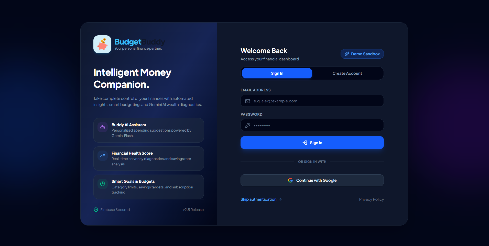
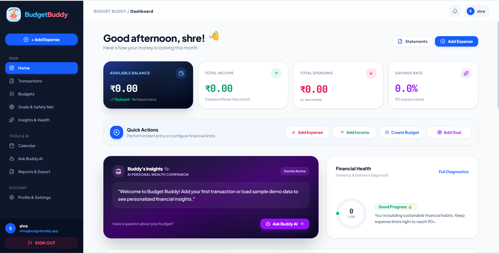
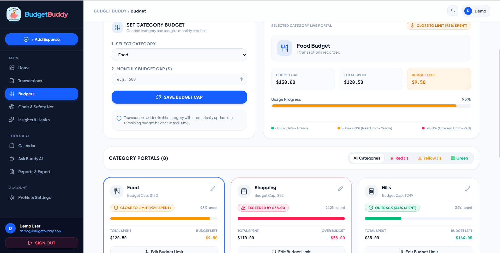
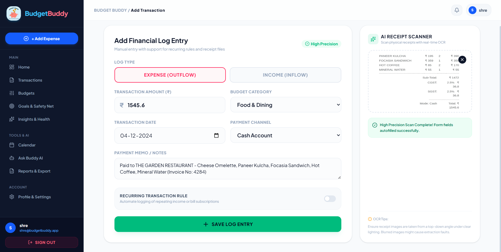
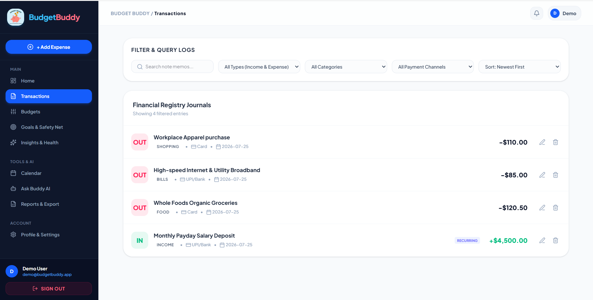
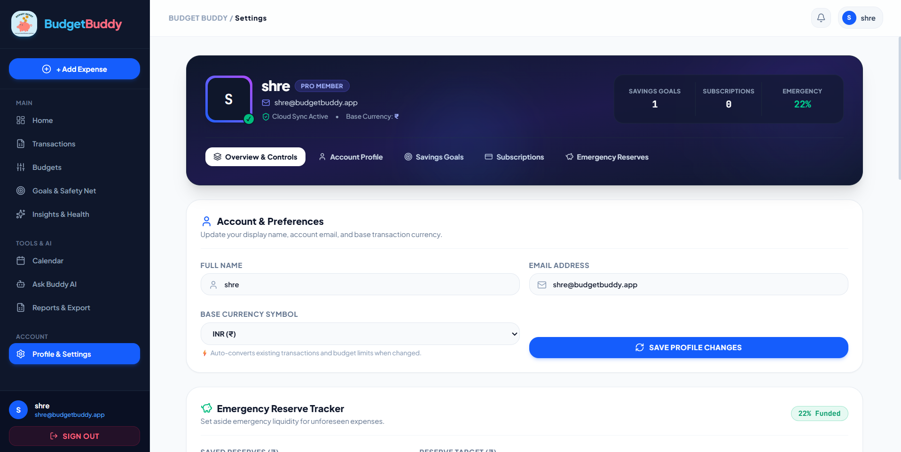
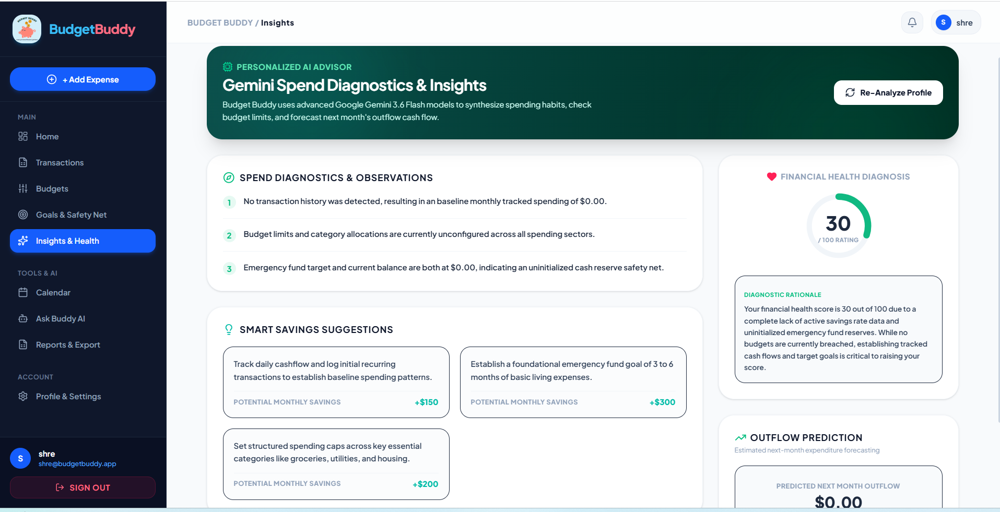

# 💰 Budget Buddy

Budget Buddy is a personal expense tracker that helps you log spending, plan budgets, set savings goals, and get AI-powered insights into your money habits. It uses **Gemini AI** to scan receipts (turning a photo into a logged transaction) and to answer natural-language questions about your finances.

## ✨ Features

- **Transaction tracking** — add, edit, filter, and search income/expenses by category, date, and payment method
- **Receipt scanning** — snap or upload a photo of a receipt; Gemini's vision API extracts the amount, category, and notes automatically
- **Budget planner** — set per-category spending limits and track usage in real time
- **Savings goals & subscriptions** — track progress toward savings targets and manage recurring bills
- **AI insights & chat assistant** — ask questions about your spending in plain English and get Gemini-generated analysis
- **Reports & calendar view** — visual breakdowns of spending over time (charts via Recharts) and a calendar view of transactions
- **Authentication** — email/password and Google sign-in via Firebase Auth
- **Per-user data isolation** — Firestore security rules ensure each user can only read/write their own data

## 🛠️ Tech Stack

- **Frontend:** React 19, TypeScript, Vite, Tailwind CSS
- **Backend:** Express (Node.js) + TypeScript
- **Database & Auth:** Firebase (Firestore + Firebase Auth)
- **AI:** Google Gemini API (`@google/genai`) for receipt OCR and the chat assistant
- **Charts:** Recharts
- **Icons/Animation:** lucide-react, motion

## 📸 Screenshots

### Authentication


### Dashboard


### Budgets


### Add Transaction & AI Receipt Scanner


### Transactions


### Profile & Settings


### AI Insights & Financial Health


## 🚀 Getting Started

### Prerequisites
- Node.js (v18+)
- A free [Firebase](https://console.firebase.google.com/) project (Firestore + Authentication enabled)
- A [Gemini API key](https://aistudio.google.com/apikey)

### Setup

1. Clone the repo
   ```bash
   git clone https://github.com/<your-username>/budget-buddy.git
   cd budget-buddy
   ```

2. Install dependencies
   ```bash
   npm install
   ```

3. Copy the environment template and fill in your own keys
   ```bash
   cp .env.example .env
   ```
   You'll need:
   - `GEMINI_API_KEY` — from Google AI Studio
   - `VITE_FIREBASE_*` — from your Firebase project settings (Project Settings → General → Your apps)

4. Deploy the Firestore security rules from `firestore.rules` to your Firebase project (via the Firebase Console or `firebase deploy --only firestore:rules`)

5. Run the app locally
   ```bash
   npm run dev
   ```

### Build for production
```bash
npm run build
npm start
```

## 🔒 Security Notes

- Firestore rules restrict every collection so a user can only read/write documents that belong to their own `uid`.
- Firebase and Gemini credentials are loaded from environment variables and are **never committed** to the repo — see `.env.example` for the required variables.

## 📂 Project Structure

```
src/
├── components/     # UI components (Dashboard, TransactionsTab, BudgetPlanner, etc.)
├── lib/            # Firebase client setup, budget benchmark helpers
├── App.tsx         # Root component / tab routing
├── types.ts        # Shared TypeScript types
server.ts           # Express server + Gemini API endpoints (receipt scan, chat assistant)
firestore.rules     # Firestore security rules
```

## 📄 License

This project is licensed under the MIT License.

 e764a3a2daea340b6f4b2cf06258cc459302bf23
